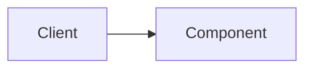

# Title

## What

Precise definition.

## Why

Problem it solves; what fails without it.

## How

Mental model. Diagrams welcome.

## Where it fits (HLD / LLD)

Which layer, service, or boundary in this platform.

## Trade-offs

Alternatives and when **not** to use this.

## Production notes

Failure modes, observability, security, ops.

## Check your understanding

1. Question that requires reasoning…
2. …
3. …

## Code in this repo

How our implementation maps to the concept (fill after coding).

## Further practice (optional)

Small exercise or follow-up experiment.
